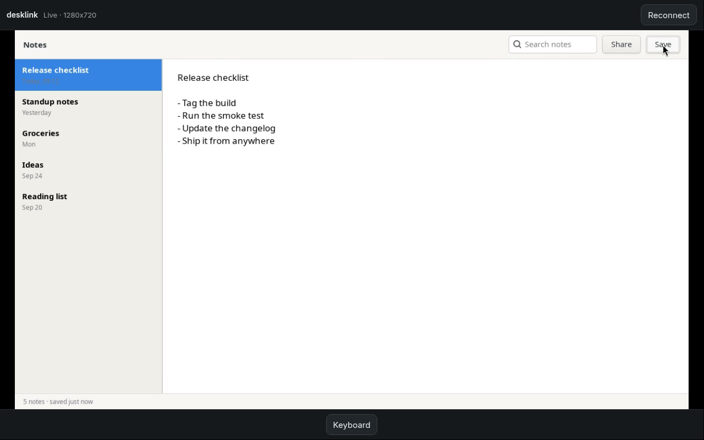
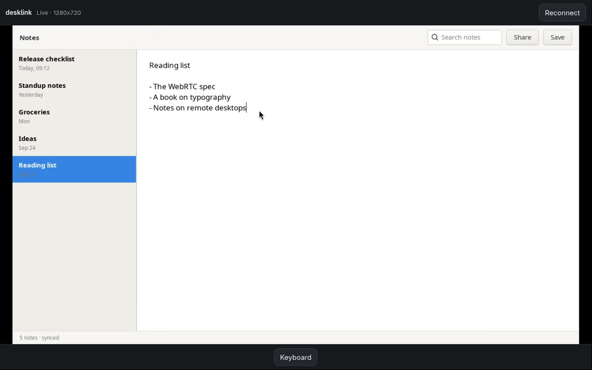
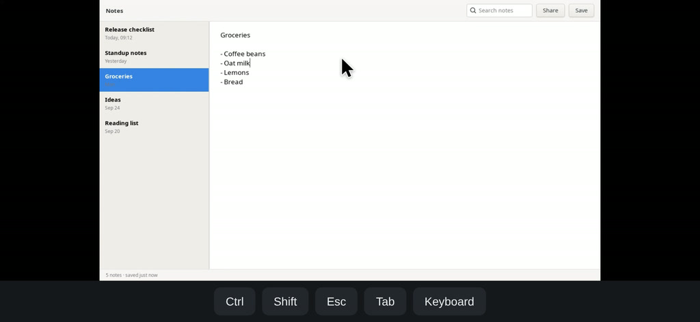
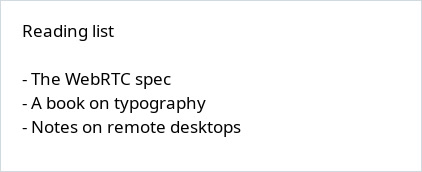
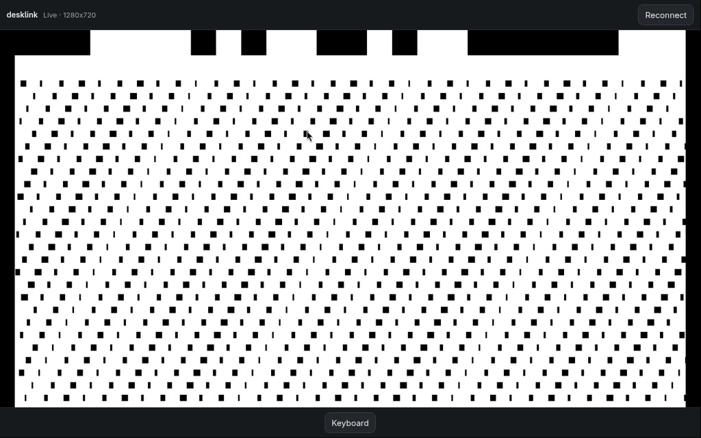

<h1 align="center">desklink</h1>

<p align="center">
  <a href="https://www.npmjs.com/package/@desklink/host"></a>
  <a href="https://github.com/umeranjum17/desklink/actions/workflows/ci.yml"></a>
  <a href="LICENSE"></a>
  
</p>

<p align="center">
  <strong>Your own desktop, live in a browser or an app, over a channel you already trust.</strong><br/>
  desklink captures a Linux desktop (macOS in preview), encodes it, carries it over WebRTC and applies the viewer's pointer, keyboard and clipboard back to the same desktop. It is a per-user process with a documented local protocol, not a service: no account, no pairing ceremony, no second identity system. Your application carries the offer and answer over the connection it already has, and a React Native view and an agent CLI sit on the same engine.
</p>

<h3 align="center"><a href="#try-it"><ins>Try it in one command</ins></a></h3>

<p align="center">
  <a href="https://www.npmjs.com/package/@desklink/host">@desklink/host on npm</a> ·
  <a href="https://www.npmjs.com/package/@desklink/react-native">@desklink/react-native on npm</a> ·
  <a href="packages/axi">@desklink/axi</a> ·
  <a href="packages/desktop-host/docs/PROTOCOL.md">The protocol</a>
</p>

<p align="center">
  <picture><source srcset="docs/assets/readme/hero.webp" type="image/webp"></picture>
</p>

## Install

```sh
npm install @desklink/host               # the engine
npx expo install @desklink/react-native  # the view and session
```

The npm version badges track the registry, and npm verifies package integrity
on install. See the [host installation guide](packages/desktop-host/README.md#install-and-run)
for supported desktop platforms and the [receiver installation guide](packages/desktop-client/README.md#install)
for Android, iOS and web setup. Release changes are in the [changelog](CHANGELOG.md).

Install the agent CLI with `npm install -g @desklink/axi`; see its [README](packages/axi/README.md#install).

## Why desklink exists

Reaching your own computer from somewhere else usually means handing it to someone else's service: an account, a relay, a pairing flow, and a second identity system beside the one your application already has. desklink turns that inside out. The engine runs as you, starts when asked and stops when told, and trusts the application that started it to decide who may see the desktop.

What it does own is the hard middle: capture with the compositor's consent, a real-time encoder tuned for text that has to stay readable on a phone, WebRTC transport, and input and clipboard that reach only the session a paired client opened.

An application supplies pairing, identity and signaling transport through the BYOKit kits — [@byokit/link](https://www.npmjs.com/package/@byokit/link) for pairing and revocation, [@byokit/relay](https://www.npmjs.com/package/@byokit/relay) for the relay, [@byokit/reach](https://www.npmjs.com/package/@byokit/reach) for reachable addresses. desklink implements none of those pieces; the app adapts its authenticated channel to the client's [`Signaling` interface](packages/desktop-client/README.md#signaling). The app maps each pairing to the sessions it opened; on revocation it closes those sessions and refuses future opens from that pairing. WebRTC media and input use a separate session, with app-supplied `iceServers` when needed; a signaling relay alone does not relay that traffic.

## See it in action

### A desktop in a browser tab

`desklink-host bridge` re-serves the engine over a WebSocket and serves the reference client, one HTML file with no build step. Open the URL it prints and the desktop is live: click, type and scroll on the picture, open the on-screen keyboard, and copy or paste when the capture source supports the clipboard.

<p align="center">
  <picture><source srcset="docs/assets/readme/reference-client.webp" type="image/webp"></picture>
</p>

### The same desktop in a React Native app

`@desklink/react-native` is a view and a session, not a screen: it draws the picture, turns touch into a desktop pointer the phone can see, and leaves the buttons to the app. Below, its web build in a landscape phone viewport: a tap selected the note, the drawn pointer shows where it landed, and the key row is the app's own, using the package's sticky modifiers.

<p align="center">
  <picture><source srcset="docs/assets/readme/react-native.webp" type="image/webp"></picture>
</p>

### A desktop an agent can drive

`desklink-axi` gives a coding agent the desktop as text first: OCR items with refs it can click, changed regions since the last look, and pixels only when it asks for a crop. This transcript is generated by a real agent turn on a private Reading list window (the OCR fixture in `packages/axi/test/flow.mjs`):

```text
$ desklink-axi screen --query "Reading list"
screen: 1280x720 frame=1 settled=true estimated_tokens=~24
text[1 of 1]{ref,text,x,y}:
  "@1.1","Reading list A book on typography and remote desktops today",33,37
help[1]:
  desklink-axi click @1.<n>
$ desklink-axi screen --query typography
screen: 1280x720 frame=1 settled=true estimated_tokens=~24
text[1 of 1]{ref,text,x,y}:
  "@1.1","Reading list A book on typography and remote desktops today",33,37
help[1]:
  desklink-axi click @1.<n>
$ desklink-axi click 200,625
input: applied
$ desklink-axi type "Notes on remote desktops" --wait settle
input: applied; frame: ready
$ desklink-axi diff
changed: 1 region since frame 1
regions[1]{ref,box}:
  @r1,"0,0,1280,720"
appeared[1 of 1]{ref,text,x,y}:
  "@4.21","Notes on remote desktops",36,612
gone: 1 text items
help[2]:
  desklink-axi look @r1
  desklink-axi screen --query "<words>"
$ desklink-axi screen --query "Notes on remote desktops"
screen: 1280x720 frame=8 settled=true estimated_tokens=~15
text[1 of 1]{ref,text,x,y}:
  "@8.3","Notes on remote desktops",36,613
help[1]:
  desklink-axi click @8.<n>
$ desklink-axi screen --query "Notes on remote desktops" --full
screen: 1280x720 frame=17 settled=true estimated_tokens=~15
text[1 of 1]{ref,text,x,y}:
  "@17.21","Notes on remote desktops",36,612
help[1]:
  desklink-axi click @17.<n>
$ desklink-axi click @17.21
input: applied
$ desklink-axi press End
input: applied
$ desklink-axi type " today" --wait settle
input: applied; frame: ready
$ desklink-axi screen --query "Notes on remote desktops today"
screen: 1280x720 frame=26 settled=true estimated_tokens=~17
text[1 of 1]{ref,text,x,y}:
  "@26.21","Notes on remote desktops today",36,612
help[1]:
  desklink-axi click @26.<n>
$ desklink-axi look --region 32,600,880,110 --out showcase.png
image: showcase.png
region: 32,600,880,110 cost: ~129 tokens to view
```

<p align="center">
  <picture><source srcset="docs/assets/readme/axi-look.webp" type="image/webp"></picture>
</p>

### Measured, not guessed

A glass-to-glass lab runs the engine against a private X display showing a stamp window: its top row encodes the wall clock at the moment it was painted, and a headless browser decodes that stamp from every presented frame, so latency is measured from pixel to pixel. When the current motion encoder landed, the lab measured, at 60 fps maximum on a shared 32-thread host (load 26–76), median of four interleaved runs ([the numbers and method](https://github.com/umeranjum17/desklink/pull/28)):

| Scenario | fps | Glass-to-glass p50 | p95 |
| --- | --- | --- | --- |
| 1920×1080, typing | 52.3 | 41.5 ms | 53 ms |
| 1920×1080, full-screen motion | 54.6 | 46 ms | 60.5 ms |
| 2560×1440, full-screen motion | 42.0 | 56.5 ms | 71 ms |

Load moves these numbers, which is why every lab run records it: rerun for this page on a host at load 125–140, 1080p typing measured 26.5 fps and 95 ms p50, and full-screen motion 9.5 fps and 288 ms p50. [`portal-g2g-flow.mjs`](packages/desktop-host/test/portal-g2g-flow.mjs) measures the ScreenCast portal and PipeWire path the same way, inside a private namespace cage.

<p align="center">
  <picture><source srcset="docs/assets/readme/lab.webp" type="image/webp"></picture>
</p>

## Packages

| Package | What it is |
| --- | --- |
| [`@desklink/host`](packages/desktop-host) | The per-user engine: screen capture, VP9/H.264 encode, WebRTC, pointer/keyboard/clipboard input, behind a [versioned local protocol](packages/desktop-host/docs/PROTOCOL.md). A prebuilt engine ships for Linux x64 (glibc 2.36+), and a preview prebuilt engine ships for macOS arm64 (`@desklink/host-darwin-arm64`). |
| [`@desklink/react-native`](packages/desktop-client) | A view and a session that render that desktop in a React Native app (Android, iOS, web) and turn touch, keyboard and clipboard into its input. |
| [`@desklink/axi`](packages/axi) | A [desktop CLI](packages/axi/README.md) for agents: text and changed regions by default, image crops on request. |

Where each piece's responsibility ends is in
[docs/BOUNDARY.md](packages/desktop-host/docs/BOUNDARY.md).

## Try it

On a Linux x64 desktop session (macOS arm64 works too, as a preview):

```sh
npx @desklink/host bridge
```

Open the `open` URL it prints, and your desktop appears in a browser tab. The page
is [`examples/reference-client.html`](packages/desktop-host/examples/reference-client.html):
one file, no build step, a complete client of the protocol. Portal capture asks
the compositor for consent first; input needs [kernel input access](packages/desktop-host/README.md#kernel-input-access).
If the desktop does not appear, `npx @desklink/host capabilities` prints what this
machine can do.

### On a phone

Start the bridge where the phone can reach it, on a private network:

```sh
npx @desklink/host bridge --listen 0.0.0.0:19400
```

Then make a new Expo app on SDK 55, the SDK the receiver is built and tested
against. One `expo install` adds the view, its WebRTC binding, the
[`@byokit/signaling`](https://www.npmjs.com/package/@byokit/signaling)
WebSocket adapter for the bridge, and both config plugins to `app.json`:

```sh
npx create-expo-app@latest desklink-quickstart --template blank-typescript@sdk-55
cd desklink-quickstart
npx expo install @desklink/react-native react-native-webrtc @config-plugins/react-native-webrtc@14 @byokit/signaling
```

Replace `App.tsx` with this, putting in the computer's address and the token
the bridge printed:

```tsx
import { useEffect } from 'react';
import { Button, View } from 'react-native';
import { authorizeBridge } from '@byokit/signaling';
import { DesktopView, useDesktopSession } from '@desklink/react-native';

const BRIDGE = 'ws://192.168.1.20:19400/desktop?token=PASTE_THE_TOKEN';
const authorize = authorizeBridge(BRIDGE, {});

export default function App() {
  const desktop = useDesktopSession({ authorize });
  const { status, failure } = desktop.snapshot;
  useEffect(() => desktop.setInputEnabled(status === 'live'), [status]);
  return (
    <View style={{ flex: 1, backgroundColor: 'black', paddingVertical: 48 }}>
      <DesktopView sessionId={desktop.nativeId} style={{ flex: 1 }} />
      {status !== 'live' && (
        <Button title={failure ? `Retry (${failure.code})` : status === 'idle' ? 'Connect' : status}
          onPress={() => void desktop.connect()} />
      )}
    </View>
  );
}
```

Run it on the phone with `npx expo run:android` or `npx expo run:ios --device`;
the view is native code, so it needs a development build, not Expo Go. Tap
Connect, approve the screen-sharing prompt if the computer shows one, and the desktop
appears; tap it to click. The [receiver README](packages/desktop-client/README.md#what-the-package-guarantees)
lists every gesture, and the keyboard, clipboard and safe-area options.
`ws://` is plaintext and the token is full access: keep it to a private network,
or put the bridge behind TLS and use `wss://`.

## Develop

```sh
npm install
npm run build          # compile @desklink/host and @desklink/axi
npm test               # the TypeScript packages' tests
npm run test:engine    # the Rust engine's tests; needs the native libraries CI installs
```

Desktop integration checks refuse ambient `DISPLAY`/`WAYLAND_DISPLAY` before
contact; unset both before running them. Use only verified, high-display,
task-owned Xvfb labs; `Xvfb -displayfd` can choose the live Xwayland `:0`.
The labs authenticate clients and verify Xvfb PID/socket ownership; cleanup
never adopts an unknown session-tagged PID. Unit/compile
checks need no desktop. On Linux, prove refusal and owned teardown with:

```sh
env -u DISPLAY -u WAYLAND_DISPLAY npm run test:lab-safety
```

For browser session ownership and migration, see the
[AXI browser lane](packages/axi/README.md#browser-lane-opt-in-loopback-only).

Releasing, including the reproducible engine build, is in
[packages/desktop-host/README.md](packages/desktop-host/README.md#building-and-packing-a-release).

The pictures on this page are real captures from a private X display, never the
machine's own desktop, and live in [`docs/assets/readme/`](docs/assets/readme).

## License

[Apache-2.0](LICENSE).
